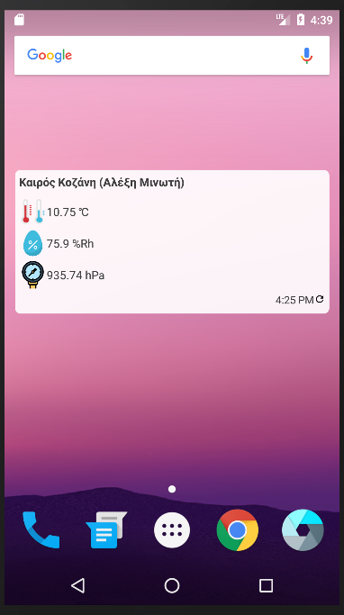
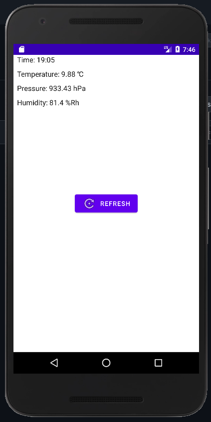

# Android client for LogingAPI project

* This is a simple Android client for my  DIY weather station wich makes use
 of the open data provided by LogingAPI project.

* The main purpose is the widget. This widget helps checking the latest value
 from the weather station without opening the browser.

* Because the widget is updated every 30 minutes due to android limitations, there is a refresh button.

* Not the most solid code because this is my first Android app, so keep in
 mind that the widget or the app may crash or have unexpected behaviour

* I would like to see some feedback for any problems you found. Download the .apk [from here](https://github.com/tsaklidis/AndroidLogger/blob/master/Logger.apk)

### TODO
* Translate the widget
* Create separate widgets for each measurement (temperature, humidity, pressure)

### Author

* **Stefanos I. Taklidis** - [tsaklidis.gr](https://tsaklidis.gr)