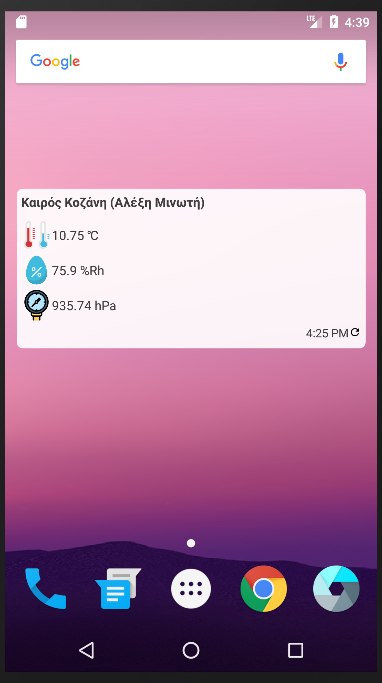
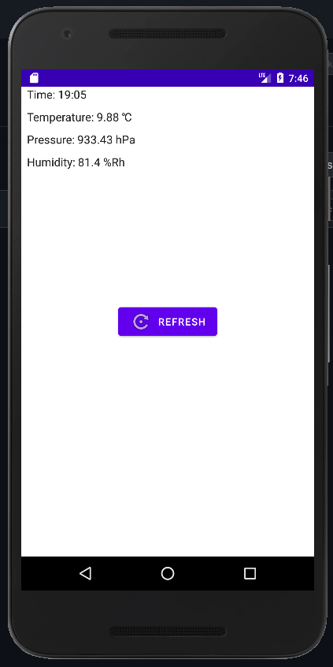

# Android client for LogingAPI project

* This is a simple Android client for my  DIY weather station wich makes use
 of the open data provided by LogingAPI project.

* The main purpose is the widget. This widget helps checking the latest value
 from the weather station without opening the browser.

* The widget displays the current temperature, humidity, and the lowest/highest
 temperature recorded in the last 12 hours.

* Because the widget is updated every 30 minutes due to android limitations, there is a refresh button.

* Not the most solid code because this is my first Android app, so keep in
 mind that the widget or the app may crash or have unexpected behaviour

* I would like to see some feedback for any problems you found. Download the .apk [from here](https://github.com/tsaklidis/AndroidLogger/blob/master/Logger.apk)

### Changelog v4.0
* Added 12-hour min/max temperature display on widget
* Removed pressure (hPa) from widget (still available in main app)
* Modernized for Android 14 (API 34) - updated compileSdk, targetSdk, dependencies
* Updated Android Gradle Plugin to 8.2.0 and Gradle to 8.2
* Raised minSdk to 24 (Android 7.0)
* Replaced deprecated `drawableLeft`/`drawableRight` with `drawableStart`/`drawableEnd`
* Replaced deprecated `<fragment>` tag with `FragmentContainerView`
* Removed deprecated `jcenter()` repository
* Updated all AndroidX dependencies to latest stable versions

### TODO
* Translate the widget
* Create separate widgets for each measurement (temperature, humidity)

### Author

* **Stefanos I. Tsaklidis** - [tsaklidis.gr](https://tsaklidis.gr)

### Icons
* Temperature Icon by: [Petai Jantrapoon](https://iconscout.com/contributors/petai-jantrapoon)
* Humidity Icon by: [Petai Jantrapoon](https://iconscout.com/contributors/petai-jantrapoon)
* Pressure Icon by: [Kerismaker Studio](https://iconscout.com/contributors/kerismaker)
